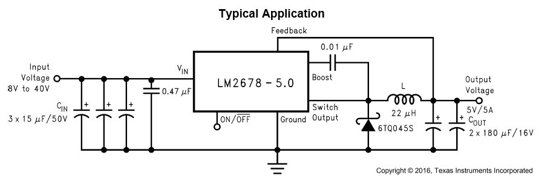
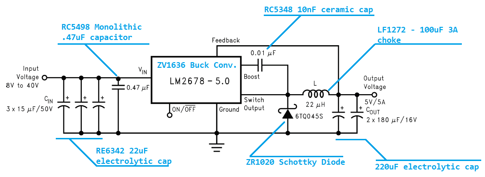

# High Efficiency Power Supply

Learn the basics of electronics in making this high efficiency 5V power supply. Using the professional standard LM2678 5V step down ( or "buck" ) regulator, we can design a power supply that takes any voltage between 5-37 and bring it down to a constant and stable 5V rail. perfect for use in your projects. You will also learn the basics of how to read and understand datasheets.

## Table of Contents

- [High Efficiency Power Supply](#High-Efficiency-Power-Supply)
  - [Table of Contents](#Table-of-Contents)
  - [Bill of Materials](#Bill-of-Materials)
  - [Checking the datasheet](#Checking-the-datasheet)
  - [Confirming the specification](#Confirming-the-specification)
  - [Selecting the components](#Selecting-the-components)
  - [Laying out the PCB board](#Laying-out-the-PCB-board)

## Bill of Materials

| Qty | Code                                     | Description                  |
| --- | ---------------------------------------- | ---------------------------- |
| 1   | [ZV1636](https://jaycar.com.au/p/ZV1636) | LM2678 5V buck converter     |
| 3   | [RE6342](https://jaycar.com.au/p/RE6342) | 22u Electrolytic capacitor   |
| 1   | [RC5498](https://jaycar.com.au/p/RC5498) | Monolithic .47 uF capacitor  |
| 1   | [RC5348](https://jaycar.com.au/p/RC5348) | 10nF ceramic cap             |
| 2   | [RE6312](https://jaycar.com.au/p/RE6312) | 220uF electrolytic capacitor |
| 1   | [LF1272](https://jaycar.com.au/p/LF1272) | 100uH 3a pre-wound choke     |
| 1   | [ZR1020](https://jaycar.com.au/p/ZR1020) | Schottky Diode               |
| 2   | [HM3172](https://jaycar.com.au/p/HM3172) | 2 way screw-down terminal    |
| 1   | [HP9550](https://jaycar.com.au/p/HP9550) | pre-punched small PCB        |

## Checking the datasheet

The first thing to do when laying out a new design is to check the [datasheet](LM2678-5-datasheet.pdf). The first page shows us some quick sale information such as the features and applications of the device, as well as the _Typical application_ for the device, which is what we're going to emulate:

## Confirming the specification

We'll be able to see what our power supply can do by checking the relevant information in the datasheet:

_On page 5 and 6:_

| Parameter     | Minimum | Typical | Maximum | Units |
| ------------- | ------- | ------- | ------- | ----- |
| Output        | 4.9     | 5       | 5.1     | Volts |
| Current Limit | 6.1     | 7       | 8.3     | Amps  |
| Efficiency    |         | 84%     |         |       |

Depending on the use for the power supply, you might also be interested to look at some of the other parameters, such as _standby quiescent current_ or _ON/OFF threshold voltage_ - for our purposes though, we're just building a generic power supply, and we're happy with this datasheet. We will use this `LM2678-5V` buck converter chip in our design.

## Selecting the components

You can see from the diagram that we have got all the parts we need from the bill of materials above:

Keen eyes would have seen that we have selected components that don't exactly match the specifications. This is common in electronics and is why a good understanding of the fundamentals are important. Very often the design doesn't quite match up with what is available or price comparable.

The biggest jump in value is from the _recommended_ 22uH inductor to the 100uH inductor, as our range of inductors are pretty slim. The component we've selected will still work fine for the job, but won't be high performance for sensitive electronics: if you were building computer or other mission critical systems, it might be better to get an inductor (and other components) a bit closer to specifications.

For capacitors, we tried to stick close to the original spec. The good thing about capacitors is that you can usually go _larger_ without causing issue. There was an interesting point from the datasheet about the use of 3 capacitors in a row, rather than 1 big capacitor:

> Paralleling multiple capacitors proportionally increases the current rating of the total capacitance.

We've noticed this ourselves when we tried to use one big capacitor; it got hot super fast. Changing to 3 smaller caps worked out well.

Enough design, let's get started!

## Laying out the PCB board

