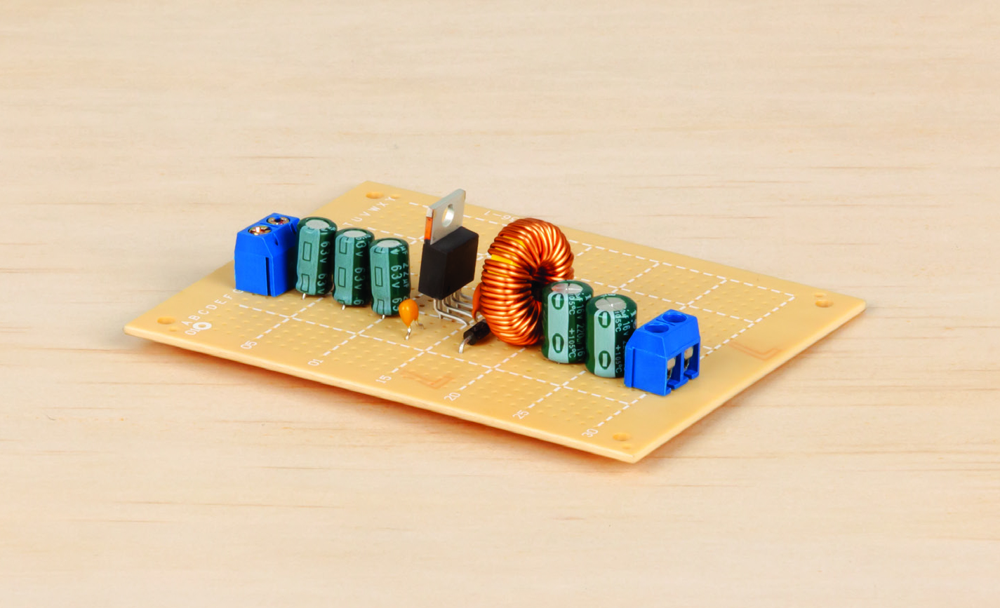
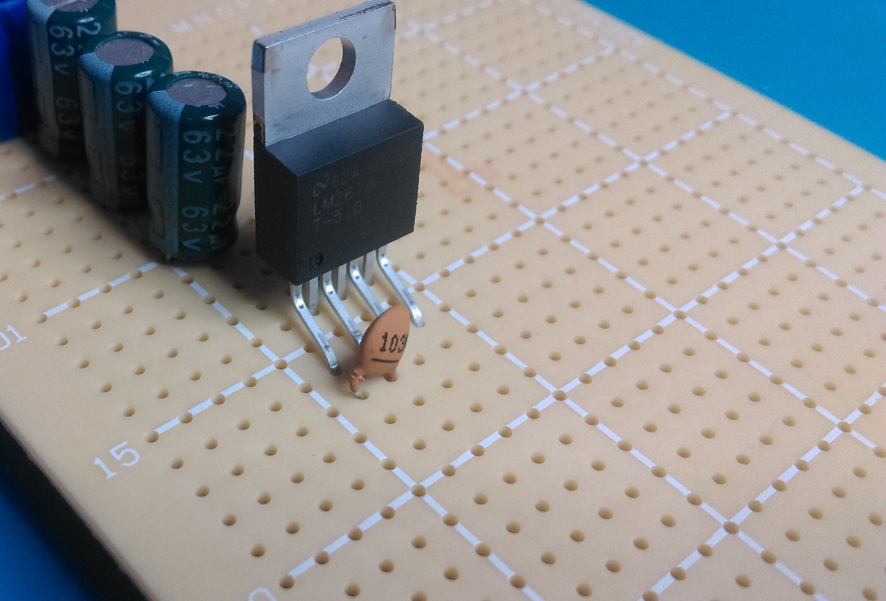

# High Efficiency Power Supply

Learn the basics of electronics in making this high efficiency 5V power supply. Using the professional standard LM2678 5V step down ( or "buck" ) regulator, we can design a power supply that takes any voltage between 5-37 and bring it down to a constant and stable 5V rail. perfect for use in your projects. You will also learn the basics of how to read and understand datasheets.

<github> View the way this project is meant to be displayed, at https://www.jaycar.com.au/high-efficiency-psu </github>

## Table of Contents

- [High Efficiency Power Supply](#High-Efficiency-Power-Supply)
  - [Table of Contents](#Table-of-Contents)
  - [Bill of Materials](#Bill-of-Materials)
  - [Checking the datasheet](#Checking-the-datasheet)
  - [Confirming the specification](#Confirming-the-specification)
  - [Selecting the components](#Selecting-the-components)
  - [Laying out the PCB board](#Laying-out-the-PCB-board)
    - [Step 1: Position the starting terminal and input capacitors](#Step-1-Position-the-starting-terminal-and-input-capacitors)
    - [Step 2: Place regulator](#Step-2-Place-regulator)
    - [Step 3: Solder into place.](#Step-3-Solder-into-place)
    - [Step 4: Place Regulator components](#Step-4-Place-Regulator-components)
    - [Step 5: Output components and final soldering](#Step-5-Output-components-and-final-soldering)
  - [Final test and use](#Final-test-and-use)

## Bill of Materials

| Qty | Code                                     | Description                  |
| --- | ---------------------------------------- | ---------------------------- |
| 1   | [ZV1636](https://jaycar.com.au/p/ZV1636) | LM2678 5V buck converter     |
| 3   | [RE6342](https://jaycar.com.au/p/RE6342) | 22u Electrolytic capacitor   |
| 1   | [RC5498](https://jaycar.com.au/p/RC5498) | Monolithic .47 uF capacitor  |
| 1   | [RC5348](https://jaycar.com.au/p/RC5348) | 10nF ceramic cap             |
| 2   | [RE6312](https://jaycar.com.au/p/RE6312) | 220uF electrolytic capacitor |
| 1   | [LF1272](https://jaycar.com.au/p/LF1272) | 100uH 3a pre-wound choke     |
| 1   | [ZR1020](https://jaycar.com.au/p/ZR1020) | Schottky Diode               |
| 2   | [HM3172](https://jaycar.com.au/p/HM3172) | 2 way screw-down terminal    |
| 1   | [HP9550](https://jaycar.com.au/p/HP9550) | pre-punched small PCB        |

## Checking the datasheet

The first thing to do when laying out a new design is to check the [datasheet](LM2678-5-datasheet.pdf). The first page shows us some quick sale information such as the features and applications of the device, as well as the _Typical application_ for the device, which is what we're going to emulate:

## Confirming the specification

We'll be able to see what our power supply can do by checking the relevant information in the datasheet:

_On page 5 and 6:_

| Parameter     | Minimum | Typical | Maximum | Units |
| ------------- | ------- | ------- | ------- | ----- |
| Output        | 4.9     | 5       | 5.1     | Volts |
| Current Limit | 6.1     | 7       | 8.3     | Amps  |
| Efficiency    |         | 84%     |         |       |

Depending on the use for the power supply, you might also be interested to look at some of the other parameters, such as _standby quiescent current_ or _ON/OFF threshold voltage_ - for our purposes though, we're just building a generic power supply, and we're happy with this datasheet. We will use this `LM2678-5V` buck converter chip in our design.

## Selecting the components

You can see from the diagram that we have got all the parts we need from the bill of materials above:

Keen eyes would have seen that we have selected components that don't exactly match the specifications. This is common in electronics and is why a good understanding of the fundamentals are important. Very often the design doesn't quite match up with what is available or price comparable.

The biggest jump in value is from the _recommended_ 22uH inductor to the 100uH inductor, as our range of inductors are pretty slim. The component we've selected will still work fine for the job, but won't be high performance for sensitive electronics: if you were building computer or other mission critical systems, it might be better to get an inductor (and other components) a bit closer to specifications.

For capacitors, we tried to stick close to the original spec. The good thing about capacitors is that you can usually go _larger_ without causing issue. There was an interesting point from the datasheet about the use of 3 capacitors in a row, rather than 1 big capacitor:

> Paralleling multiple capacitors proportionally increases the current rating of the total capacitance.

We've noticed this ourselves when we tried to use one big capacitor; it got hot super fast. Changing to 3 smaller caps worked out well.

Enough design, let's get started!

## Laying out the PCB board

Due to how this device almost has a linear in/out flow to it, we're going to make this designed in a line, using no more than half of the PCB board. If you were fitting this into another project you have, feel free to change the layout to make it fit. As long as all the connections are the same, it will work.

It is important to remember the pinout for device, which is different depending on what version of the package we've got. You can see the pinout options on page 3 of the datasheet. The [ZV1636](https://jaycar.com.au/p/ZV1636) is a TO-220 package.

**Note!** if you trim the leads off capacitors, keep them aside for later, you might need them to make bridging connections!

### Step 1: Position the starting terminal and input capacitors

Starting with the terminal and input capacitors, we're going to put them on one end of the board and fairly tight up against each other. The screw terminal needs force to fit in but be careful of not wiggling it too much, otherwise it can pull up the copper pad underneith.
Each capacitor has a strip that denotes which pin is negative, so make sure that all of these strips are facing the same way.

Here we put the strips facing down towards the edge of the board. You can use a small amount of solder on the legs to hold the capacitors in place for now; you'll see what soldering looks like in Step 3.

### Step 2: Place regulator

you can see here where we've placed the regulator so that we can wire up the input into pin 2 of the regulator.

The staggered pin is a little different to the layout of the [HP9550](https://jaycar.com.au/p/HP9550) but with a gentle wiggle it can be put into place.

This means that pin2 fits into the spot at (G,14). pin3 follows and ends up in pin (G,16).

You can gently bend the pins so that the regulator doesn't fall out, if you want. Then just place the CB bootstrap capacitor, [RC5348](https://jaycar.com.au/p/RC5348)

### Step 3: Solder into place.

We've annotated the diagram for you to make it a little more understandable. When you flip the board over, the pin numbers get switched, so remember that they stagger up and pin 2 is the INPUT pin. We also solder the capacitor between pins 1 & 3, and the ground connection up to 4, making sure that GND is not connected to any other pin through solder bridges or not. If you make a mistake, clean it up with some [NS3028](https://jaycar.com.au/p/NS3028) before continuing. (if you have a brown sludge on the board, that is just burnt flux and can be washed off with [NA1066](https://jaycar.com.au/p/NA1066)).

### Step 4: Place Regulator components

Next up is the coil and schottky diode. according to the datasheet, the coil must be inline and the diode is going to ground, so this is an easy layout to replicate on our board.

Underneath, we just solder this where you would expect, the coil's legs are bent to match up with pin 1 of the regulator (OUTPUT) and towards the opposite side, where we will put the final pieces.

Place it there for starters, we will solder it once we got all the parts in.

### Step 5: Output components and final soldering

The two final capacitors are placed in front of the coil and the screw terminal is forced in. Similar to before, we match up the negative strip of the capacitors to be towards the edge of the PCB.

Then we solder everything in place. We've annotated the soldering diagram for you so you should be able to mentally see where everything is. The only additions are the bridging connection from the input ground to the output ground, and the feedback pin from the regulator going to the output side of the large coil.

## Final test and use

Once everything is soldered in, double check all the connections with a multimeter, and once you're happy with the connections, connect it up to a power supply. You should find from whatever power supply you connect to it, it should read a fairly stable 5V signal.

If you look at some points using an oscilloscope, you'll find the principle behind how it works: The _switching regulator_ will actually turn the power ON and OFF again very fast in order to maintain a steady _average_ voltage of 5V.

This is what makes it different to the cheaper [ZV1505](https://jaycar.com.au/p/ZV1505) 7805 regulator.If you turn the input voltage all the way up to 40V with our design, the regulator should still be cold to touch. With a regular 7805 chip, the chip would "burn off" the extra 35V in pure heat to keep the 5V rail, which would need a very large heatsink to handle.
